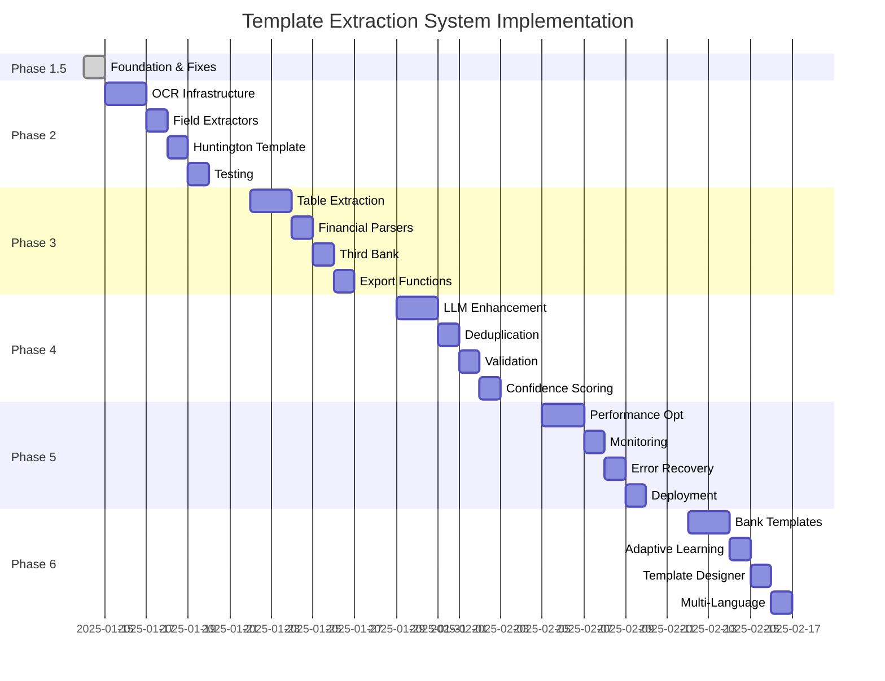

# Template-Based Extraction System: Complete Implementation Roadmap

## Executive Summary

This document outlines the complete implementation roadmap for transitioning from an image-based LLM extraction system to a template-based extraction pipeline. The new system will reduce costs by 100%, improve speed by 25x, and provide deterministic, auditable results for loan application processing.

### Key Objectives
- **Cost Reduction**: $0 per document (vs $0.01-0.02)
- **Speed Improvement**: <2 seconds per document (vs 25+ seconds)
- **Accuracy Target**: 95%+ on digital forms, 85%+ on scanned documents
- **Bank Coverage**: 3 partner banks with 9-15 forms total
- **Timeline**: 6 weeks total implementation

---

## Current State (Phase 1.5 Complete)

### Achievements
- ✅ Template registry and specification system
- ✅ AcroForm extractor (20 fields)
- ✅ Checkbox extractor (2 fields)
- ✅ Anchor-based extractor (improved)
- ✅ Field normalizer with validation
- ✅ Live Oak template (25 fields, 88% coverage)
- ✅ 25x speed improvement demonstrated

### Metrics
| Metric | Current | Target |
|--------|---------|--------|
| Coverage (Digital) | 88% | 95% |
| Coverage (Scanned) | 0% | 85% |
| Processing Time | 0.05s | <2s |
| Banks Supported | 1 | 3+ |
| Forms Supported | 1 | 9-15 |
| API Cost | $0 | $0 |

---

## Phase 2: OCR & Multi-Bank Support (Week 2)

### Objectives
- Add OCR support for scanned documents
- Create Huntington Bank template
- Implement date and money field extraction
- Add document classification

### Deliverables

#### 2.1 OCR Infrastructure (Days 1-2)
```
src/template_extraction/
├── extractors/
│   ├── ocr.py                 # OCR-based extraction
│   └── zone.py                # Zone-based extraction
├── classifier.py               # Document type detection
└── utils/
    ├── image_processing.py     # Image enhancement
    └── ocr_utils.py           # OCR helpers
```

**Technical Specifications:**
- **OCR Engine**: EasyOCR (primary), PaddleOCR (fallback)
- **Supported Languages**: English, Spanish
- **Confidence Threshold**: 0.7
- **Image Enhancement**: Deskew, denoise, contrast adjustment
- **Zone Detection**: Template-based regions

#### 2.2 Field Type Extractors (Day 3)
```
src/template_extraction/extractors/
├── date.py                    # Date extraction & parsing
├── money.py                   # Currency extraction
├── phone.py                   # Phone number extraction
└── address.py                 # Address parsing
```

**Date Formats Supported:**
- MM/DD/YYYY, MM-DD-YYYY, YYYY-MM-DD
- Month DD, YYYY (January 15, 2025)
- Relative dates ("established 2019")
- Partial dates (MM/YY for expiration)

#### 2.3 Huntington Bank Template (Day 4)
```
templates/form_specs/
├── huntington_pfs_v1.json        # Personal Financial Statement
├── huntington_business_v1.json   # Business Application
└── huntington_debt_v1.json       # Debt Schedule
```

**Field Coverage Targets:**
- Personal Financial Statement: 40 fields
- Business Application: 35 fields
- Debt Schedule: Table extraction

#### 2.4 Testing & Integration (Day 5)
- OCR accuracy benchmarks
- Cross-bank field mapping
- Performance testing
- Integration test suite

### Success Metrics
- [ ] OCR extracts 70%+ fields from scanned documents
- [ ] Huntington template achieves 85%+ coverage
- [ ] Date extraction accuracy > 90%
- [ ] Processing time < 3 seconds with OCR

---

## Phase 3: Table Extraction & Third Bank (Week 3)

### Objectives
- Implement comprehensive table extraction
- Add third partner bank (TBD)
- Support complex financial statements
- Add Excel/CSV export

### Deliverables

#### 3.1 Table Extraction Engine (Days 1-2)
```
src/template_extraction/extractors/
├── table.py                   # Main table extractor
├── strategies/
│   ├── pdfplumber_tables.py  # PDFPlumber strategy
│   ├── camelot_tables.py     # Camelot strategy
│   ├── ocr_tables.py         # OCR-based tables
│   └── llm_tables.py         # LlamaParse fallback
```

**Table Types Supported:**
- Debt schedules (creditor, balance, payment)
- Asset/Liability statements
- Income statements
- Cash flow statements
- Ownership structures

#### 3.2 Financial Statement Parser (Day 3)
```
src/template_extraction/parsers/
├── balance_sheet.py          # Balance sheet parser
├── income_statement.py       # P&L parser
├── cash_flow.py             # Cash flow parser
└── debt_schedule.py         # Debt schedule parser
```

**Parsing Features:**
- Row/column header detection
- Total validation
- Multi-page table continuation
- Nested table support

#### 3.3 Third Bank Template (Day 4)
Options (TBD based on business priority):
- Wells Fargo
- Chase
- Bank of America
- Regional bank

#### 3.4 Export Functionality (Day 5)
```
src/template_extraction/exporters/
├── excel_exporter.py         # Export to Excel
├── csv_exporter.py          # Export to CSV
├── json_exporter.py         # Structured JSON
└── xml_exporter.py          # XML for integration
```

### Success Metrics
- [ ] Table extraction accuracy > 85%
- [ ] Support for 5+ table formats
- [ ] Third bank template complete
- [ ] Export to Excel/CSV working
---

## Phase 4: LLM Enhancement & Intelligence (Week 4)

### Objectives
- Add LLM-based normalization for ambiguous fields
- Implement intelligent deduplication
- Add confidence scoring
- Build validation framework

### Deliverables

#### 4.1 LLM Normalizer (Days 1-2)
```
src/template_extraction/normalizers/
├── llm.py                    # LLM-based normalization
├── strategies/
│   ├── name_normalizer.py   # Name standardization
│   ├── address_normalizer.py # Address standardization
│   └── business_normalizer.py # Business name matching
```

**LLM Integration:**
- Minimal context prompts (<500 tokens)
- Cached responses
- Fallback to rules-based
- Confidence thresholds

#### 4.2 Deduplication System (Day 3)
```
src/template_extraction/
├── dedupe.py                 # Main deduplication engine
├── matchers/
│   ├── entity_matcher.py    # Entity resolution
│   ├── address_matcher.py   # Address matching
│   └── document_matcher.py  # Document similarity
```

**Deduplication Features:**
- Fuzzy matching
- Entity resolution
- Conflict resolution
- Audit trail

#### 4.3 Validation Framework (Day 4)
```
src/template_extraction/validators/
├── field_validator.py        # Field-level validation
├── form_validator.py        # Form-level validation
├── business_rules.py       # Business logic validation
└── compliance_checker.py   # Regulatory compliance
```

**Validation Rules:**
- Field format validation
- Cross-field validation
- Business logic rules
- Regulatory requirements

#### 4.4 Confidence Scoring (Day 5)
```
src/template_extraction/confidence/
├── scorer.py                # Confidence scoring engine
├── factors/
│   ├── extraction_confidence.py
│   ├── validation_confidence.py
│   └── source_confidence.py
```

### Success Metrics
- [ ] LLM normalization improves accuracy by 5%+
- [ ] Deduplication catches 95%+ duplicates
- [ ] Validation catches 90%+ errors
- [ ] Confidence scores correlate with accuracy

---

## Phase 5: Production Optimization (Week 5)

### Objectives
- Optimize performance for production
- Implement caching strategies
- Add monitoring and logging
- Build error recovery

### Deliverables

#### 5.1 Performance Optimization (Days 1-2)
```
src/template_extraction/optimization/
├── parallel_processor.py    # Parallel extraction
├── batch_processor.py       # Batch processing
├── cache_manager.py        # Advanced caching
└── resource_manager.py     # Resource optimization
```

**Optimization Targets:**
- Parallel extraction for multi-page docs
- Batch processing for document sets
- Smart caching with TTL
- Memory optimization

#### 5.2 Monitoring & Observability (Day 3)
```
src/template_extraction/monitoring/
├── metrics.py              # Performance metrics
├── logging.py             # Structured logging
├── tracing.py            # Distributed tracing
└── alerts.py             # Alert configuration
```

**Metrics Tracked:**
- Extraction latency
- Field coverage
- Error rates
- Cache hit rates
- Resource usage

#### 5.3 Error Recovery (Day 4)
```
src/template_extraction/recovery/
├── retry_manager.py       # Retry logic
├── fallback_handler.py   # Fallback strategies
├── error_reporter.py     # Error reporting
└── manual_review.py      # Manual review queue
```

#### 5.4 Production Deployment (Day 5)
- Docker containerization
- CI/CD pipeline setup
- Load testing
- Documentation

### Success Metrics
- [ ] Process 100+ documents/minute
- [ ] 99.9% uptime
- [ ] <2 second p95 latency
- [ ] Automatic error recovery

---

## Phase 6: Advanced Features & Scale (Week 6)

### Objectives
- Add remaining bank templates
- Implement adaptive learning
- Build template designer UI
- Add multi-language support

### Deliverables

#### 6.1 Additional Bank Templates (Days 1-2)
- Complete templates for all 9-15 forms
- Cross-bank field mapping
- Universal field dictionary
- Template versioning system

#### 6.2 Adaptive Learning (Day 3)
```
src/template_extraction/learning/
├── feedback_loop.py       # User feedback integration
├── pattern_learner.py     # Pattern recognition
├── template_optimizer.py  # Template optimization
└── accuracy_tracker.py    # Accuracy tracking
```

#### 6.3 Template Designer (Day 4)
```
src/template_extraction/designer/
├── visual_mapper.py       # Visual field mapping
├── template_builder.py    # Template creation
├── validator_ui.py       # Validation testing
└── preview_engine.py     # Live preview
```

#### 6.4 Multi-Language Support (Day 5)
- Spanish document support
- Chinese document support
- Language detection
- Translated templates

### Success Metrics
- [ ] All 9-15 forms supported
- [ ] Adaptive learning improves accuracy 3%+
- [ ] Template designer reduces setup time 80%
- [ ] Multi-language accuracy > 80%

---

## Implementation Timeline



---

## Risk Management

### Technical Risks

| Risk | Impact | Probability | Mitigation |
|------|--------|-------------|------------|
| OCR accuracy below target | High | Medium | Multiple OCR engines, manual review queue |
| Template maintenance burden | Medium | High | Template designer, version control |
| Performance degradation | High | Low | Caching, parallel processing |
| Integration complexity | Medium | Medium | Modular architecture, extensive testing |

### Business Risks

| Risk | Impact | Probability | Mitigation |
|------|--------|-------------|------------|
| Bank form changes | High | Medium | Version tracking, change detection |
| Regulatory compliance | High | Low | Validation framework, audit trail |
| User adoption | Medium | Low | Training, documentation, UI |
| Scaling challenges | Medium | Medium | Cloud deployment, horizontal scaling |

---

## Resource Requirements

### Development Team
- **Phase 2-3**: 1 senior developer
- **Phase 4-5**: 2 developers (1 senior, 1 mid)
- **Phase 6**: 2 developers + 1 QA engineer

### Infrastructure
- **Development**: Local machines sufficient
- **Testing**: Cloud instance with GPU for OCR
- **Production**: 
  - 2 application servers (4 CPU, 8GB RAM)
  - 1 Redis cache server
  - S3 or equivalent for document storage

### External Services
- **Required**: None (all self-hosted)
- **Optional**: 
  - LlamaParse API (trial/paid for complex tables)
  - Google Document AI (for difficult scans)
  - AWS Textract (backup OCR)

---

## Success Criteria

### Phase 2 (End of Week 2)
- ✅ OCR processing working
- ✅ 2 banks supported
- ✅ 70%+ coverage on scanned docs
- ✅ Date/money extraction working

### Phase 3 (End of Week 3)
- ✅ Table extraction operational
- ✅ 3 banks supported
- ✅ Excel/CSV export
- ✅ 85%+ coverage on all docs

### Phase 4 (End of Week 4)
- ✅ LLM normalization integrated
- ✅ Deduplication working
- ✅ Validation framework complete
- ✅ 90%+ accuracy

### Phase 5 (End of Week 5)
- ✅ Production-ready performance
- ✅ Monitoring in place
- ✅ Error recovery working
- ✅ <2 second latency

### Phase 6 (End of Week 6)
- ✅ All forms supported
- ✅ Adaptive learning active
- ✅ Template designer available
- ✅ Multi-language support

---

## Migration Strategy

### Parallel Operation (Weeks 1-4)
- Run both systems in parallel
- Compare results
- Route based on confidence
- Collect metrics

### Gradual Cutover (Weeks 5-6)
- Route digital PDFs to template system
- Keep LLM for unstructured docs
- Monitor accuracy
- Adjust thresholds

### Full Migration (Post Week 6)
- Template system as primary
- LLM as fallback only
- Deprecate old system
- Archive old code

---

## Maintenance & Evolution

### Ongoing Maintenance
- Template updates for form changes
- OCR model improvements
- Performance optimization
- Bug fixes

### Future Enhancements
- AI-powered template generation
- Real-time collaboration
- Mobile app support
- Blockchain verification
- Advanced analytics

### Long-term Vision
- Fully automated loan processing
- Instant approval decisions
- Regulatory compliance automation
- Industry-standard solution

---

## Conclusion

This roadmap provides a clear path from the current prototype to a production-ready, scalable template-based extraction system. The phased approach minimizes risk while delivering incremental value. Each phase builds on the previous, creating a robust foundation for long-term success.

### Key Benefits
- **Immediate**: 25x speed improvement, 100% cost reduction
- **Short-term**: Multi-bank support, OCR capability
- **Long-term**: Scalable, maintainable, extensible platform

### Next Steps
1. Review and approve roadmap
2. Allocate resources
3. Begin Phase 2 implementation
4. Establish weekly progress reviews

---

## Appendices

### A. Technical Architecture
[Detailed architecture diagrams and data flow]

### B. API Specifications
[Internal API documentation]

### C. Template Specification Format
[Complete template JSON schema]

### D. Testing Strategy
[Comprehensive testing plan]

### E. Deployment Guide
[Production deployment procedures]